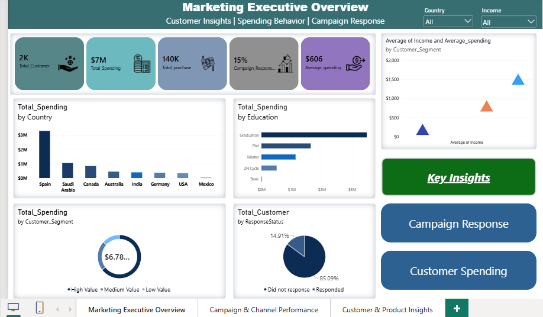
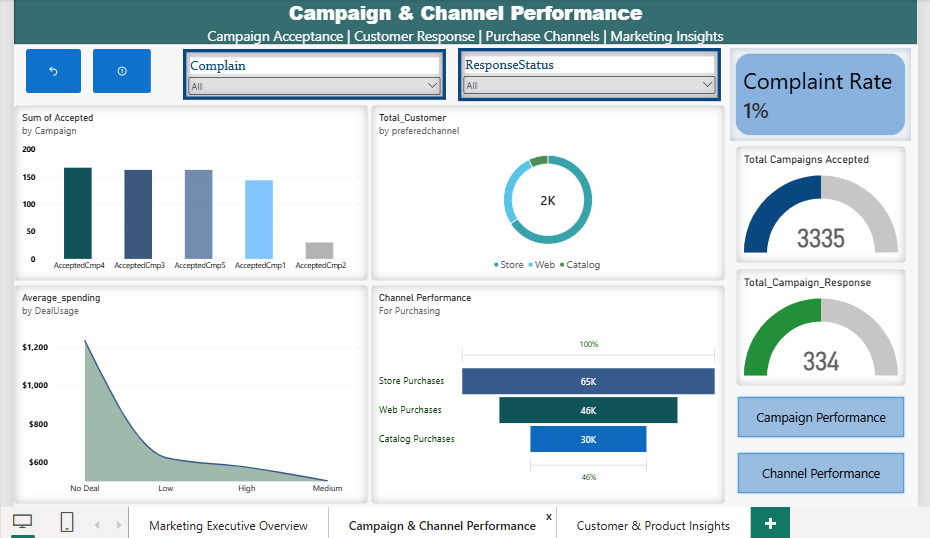
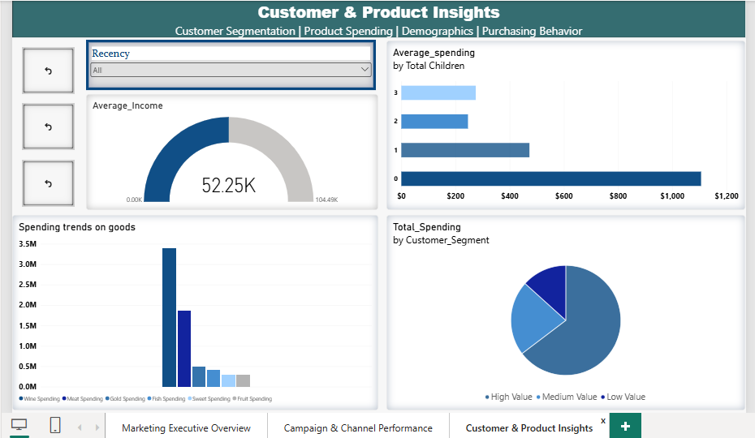

# 📊 Maven Marketing Campaign Analysis

Power BI analysis of customer behavior, marketing campaign response, purchasing channels, and customer segmentation.

## 🎯 Project Objective

The objective of this project is to analyze customer purchasing behavior and marketing campaign responses to identify valuable customer segments, understand purchasing channels, and evaluate campaign performance.

## 🧩 Business Questions

- Which customer segments contribute the most spending?
- Which countries and education groups generate higher spending?
- What factors are associated with campaign response?
- Which purchasing channels are most preferred?
- How does customer spending vary across product categories?
- How does deal usage relate to customer spending?
- Which marketing campaigns receive the highest customer acceptance?

## 🛠️ Tools Used

- Microsoft Power BI
- Power Query
- DAX
- GitHub

## 📊 Dashboard Preview

### 1. Marketing Executive Overview



### 2. Campaign & Channel Performance



### 3. Customer & Product Insights



## 📈 Key KPIs

- Total Customers
- Total Spending
- Total Purchases
- Campaign Response Rate
- Average Spending

## 🔍 Key Insights

Key business insights will be documented after final validation of the dashboard results.

## 📂 Project Structure

```text
Dashboard/
    01_Marketing_Executive_Overview.png
    02_Campaign_Channel_Performance.png
    03_Customer_Product_Insights.png

PowerBI/
    Marketing_Campaign_Analysis.pbix

Dataset/
    README.md

Documentation/
    Business_Problem.md
    Data_Dictionary.md
    Insights.md

DAX/
    Measures.md